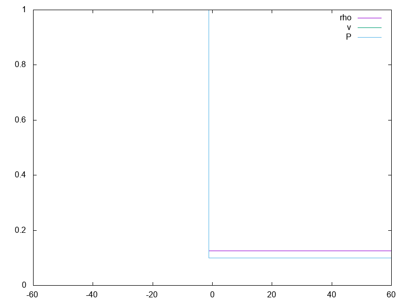

I'm trying to figure this out  
  
Going by http://www.mpia.de/homes/dullemon/lectures/fluiddynamics08/chap_6_numhyd_riemann_1.pdf  
and then http://www.mpia.de/homes/dullemon/lectures/fluiddynamics/Chapter_6.pdf  
and then https://en.wikipedia.org/wiki/Sod_shock_tube  
and then 1977 Sod "A Survey of Several Finite Difference Methods for Systems of Nonlinear Hyperbolic Conservation Laws"  
and then finally http://www.itam.nsc.ru/flowlib/SRC/sod.f was the winner  
  

Here's my derivations from Dullemon, somewhat updated to Wikipedia, though not fully to the final result:  
[Sod shock tube solution](https://htmlpreview.github.io/?https://github.com/thenumbernine/Sod_exact/blob/master/Sod%20shock%20tube%20solution.html)
